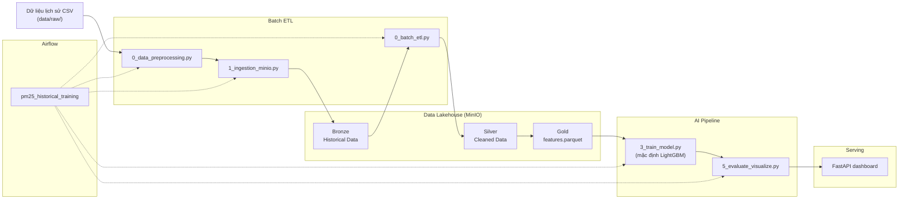
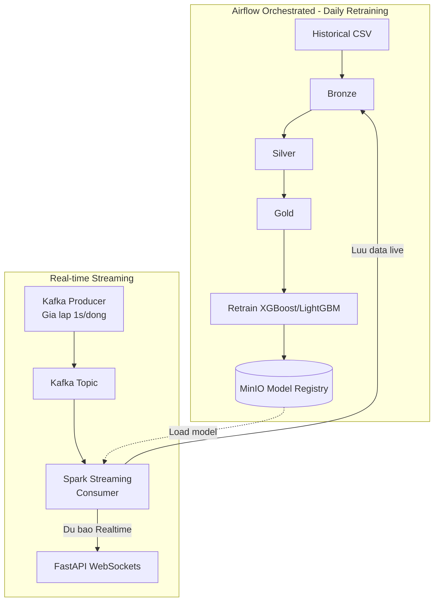

# Kiến trúc hệ thống — Hệ dự báo PM2.5 Bắc Kinh

Kiến trúc tập trung vào luồng batch lịch sử: xây lakehouse, huấn luyện model, đánh giá và phục vụ dashboard. Helper trong `feature_schema.py` chuẩn hóa cột, target và feature cho train / eval / inference batch.

## Thành phần chính

- `data/raw/`: nguồn CSV lịch sử.
- MinIO: Bronze, Silver, Gold.
- Spark / batch ETL: xử lý dữ liệu lịch sử.
- Kafka: ingest dữ liệu realtime (producer/consumer).
- Spark Structured Streaming: dự báo realtime + ghi Bronze live.
- XGBoost / LightGBM / LSTM: huấn luyện và so sánh model.
- FastAPI: dashboard so sánh model + realtime WebSocket.
- Airflow: điều phối DAG `pm25_historical_training` và DAG daily retraining.

## Luồng dữ liệu

1. Raw CSV được tiền xử lý và nạp vào Bronze.
2. `src/0_batch_etl.py` / `src/2_spark_etl.py` tạo Silver và Gold.
3. `src/3_train_model.py` huấn luyện model (mặc định LightGBM nếu không set `TRAIN_MODEL`).
4. `src/5_evaluate_visualize.py` đánh giá và xuất metrics/biểu đồ.
5. `src/main.py` phục vụ dashboard so sánh model qua `evaluation_data.py`.
6. `airflow/dags/pm25_orchestration_dag.py` chạy chuỗi preprocess → ingest → ETL → train → evaluate.

## Mermaid

## Online Predicting + Retraining (Batch + Speed Layer)

