# Kiến trúc hệ thống — Hệ dự báo PM2.5 Bắc Kinh

Kiến trúc này tách rõ 2 luồng điều khiển: batch historical để xây model và hourly realtime để tạo forecast T+1 cho dashboard. Cả hai luồng hiện dùng chung helper schema để chuẩn hóa cột, target và feature history.

## Thành phần chính
- `data/raw/`: nguồn CSV lịch sử.
- MinIO: Bronze, Silver, Gold và snapshot realtime.
- Spark: batch ETL lịch sử.
- LightGBM/XGBoost: huấn luyện model.
- Cassandra: lưu forecast T+1.
- FastAPI: API phục vụ dashboard, có route chuẩn hóa và alias tương thích.
- Airflow: scheduler/orchestrator cho batch và hourly flows.
- Grafana: hiển thị forecast.

## Luồng dữ liệu
1. Raw CSV lịch sử được nạp vào Bronze historical.
2. `src/0_batch_etl.py` / `src/2_spark_etl.py` tạo Silver và Gold batch.
3. `src/3_train_model.py` hoặc `src/3a_train_xgboost.py` / `src/3b_train_lightgbm.py` huấn luyện model từ Gold.
4. `src/1_ingest_api.py` đẩy payload realtime vào Bronze realtime.
5. `src/2_hourly_etl.py` tạo snapshot features mới nhất cho realtime inference bằng cùng helper schema.
6. `src/4_realtime_inference.py` dự báo T+1 và ghi kết quả vào Cassandra.
7. `src/main.py` đọc Cassandra để phục vụ dashboard.
8. `airflow/dags/pm25_orchestration_dag.py` điều phối DAG batch và hourly.

## Mermaid

```mermaid
flowchart LR

    SRC["Dữ liệu lịch sử CSV<br>(data/raw/)"]
    WEATHER["Weather API<br/>Temperature / Humidity"]
    AQI["Air Quality API<br/>PM2.5"]

    INGEST["1_ingest_api.py<br/>Kéo dữ liệu API mỗi giờ"]

    subgraph LAKE["Data Lakehouse (MinIO)"]
        direction TB
        BRONZE_HIST["Bronze<br/>Historical Data"]
        BRONZE_RT["Bronze<br/>Real-time API Data"]
        SILVER["Silver<br/>Cleaned Data"]
        GOLD_TRAIN["Gold<br/>Features.parquet (Full)"]
        GOLD_RT["Gold<br/>Features (1 giờ mới nhất)"]
    end

    subgraph SPARK["Apache Spark / ETL Engine"]
        direction TB
        BATCH_ETL["0_batch_etl.py<br/>Spark: Xử lý dữ liệu CSV khổng lồ"]
        STREAM_ETL["2_hourly_etl.py<br/>Tạo Feature cho cửa sổ 48 giờ<br/>(shared schema)"]
    end

    subgraph ML["AI & Forecasting Pipeline"]
        direction TB
        TRAIN["3_train_model.py<br/>(XGBoost / LightGBM)"]
        REG["MLflow Tracking Server<br/>Local: mlruns/"]
        PRED["4_realtime_inference.py<br/>Dự báo nồng độ 1h tới"]
    end

    subgraph APP["Serving & Application Layer"]
        direction TB
        CASS["Cassandra<br/>pm25_forecast_hourly"]
        API["FastAPI Backend<br/>main.py<br/>(/forecasts/* + /api/*)"]
        WEB["React / Next.js Dashboard"]
        GRAF["Grafana Dashboard"]
    end

    subgraph ORCH["Orchestration Layer"]
        direction TB
        ADF["Apache Airflow<br/>Bộ chỉ huy duy nhất"]
        BATCH_DAG["pm25_historical_training<br/>Batch DAG"]
        HOURLY_DAG["pm25_hourly_forecast<br/>Hourly DAG"]
    end

    SRC -->|Upload| BRONZE_HIST
    BRONZE_HIST -->|Read All| BATCH_ETL
    BATCH_ETL -->|Clean & Shift Target| SILVER
    SILVER -->|Feature Engineering| GOLD_TRAIN
    GOLD_TRAIN -->|Load Data| TRAIN
    TRAIN -->|Save & Log Model| REG

    WEATHER --> INGEST
    AQI --> INGEST
    INGEST -->|Save Latest JSON| BRONZE_RT

    BRONZE_RT -->|Read Latest| STREAM_ETL
    STREAM_ETL -->|Generate Snapshot| GOLD_RT

    GOLD_RT -->|Input Features| PRED
    REG -.->|Load Best Model| PRED
    PRED -->|Insert Dự báo T+1| CASS

    CASS --> API --> WEB
    CASS --> GRAF

    ADF -.->|Trigger batch DAG| BATCH_DAG
    ADF -.->|Trigger hourly DAG| HOURLY_DAG

    BATCH_DAG -->|Task chain| BATCH_ETL
    HOURLY_DAG -->|Task chain| INGEST

    classDef storage fill:#f9f2ec,stroke:#d9b38c,stroke-width:2px;
    classDef compute fill:#e6f3ff,stroke:#99ccff,stroke-width:2px;
    classDef ml fill:#f0f9e8,stroke:#8fd19e,stroke-width:2px;
    classDef app fill:#f3e8ff,stroke:#bb86fc,stroke-width:2px;
    classDef orchestration fill:#fff4e6,stroke:#ff9933,stroke-width:2px,stroke-dasharray: 5 5;

    class BRONZE_HIST,BRONZE_RT,SILVER,GOLD_TRAIN,GOLD_RT,CASS storage;
    class BATCH_ETL,STREAM_ETL,INGEST compute;
    class TRAIN,REG,PRED ml;
    class API,WEB,GRAF app;
    class ADF orchestration;
```

