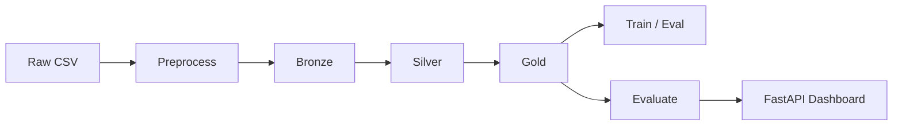
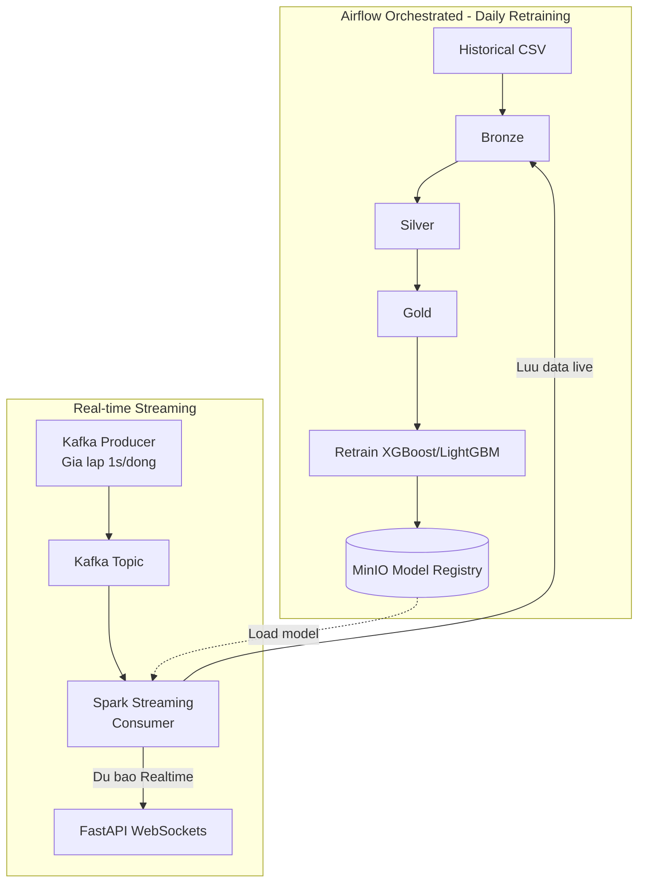

# Hệ dự báo PM2.5 — Bắc Kinh

Pipeline lakehouse batch: dữ liệu lịch sử đi qua Bronze/Silver/Gold để huấn luyện, đánh giá và inference batch. Apache Airflow điều phối DAG `pm25_historical_training` (preprocess → ingest → ETL → train → evaluate). Task train gọi `3_train_model.py` với mặc định **LightGBM** khi không set `TRAIN_MODEL`. Các script dùng chung helper trong `feature_schema.py`.

## Kiến trúc chính
- MinIO lưu Bronze, Silver, Gold.
- Spark ETL tạo Silver và Gold cho dữ liệu lịch sử.
- XGBoost và LightGBM huấn luyện trên Gold lịch sử.
- FastAPI trong `src/main.py` phục vụ dashboard so sánh model (MAE, RMSE, R², scatter, timeline).
- Airflow trong `airflow/dags/pm25_orchestration_dag.py` điều phối DAG batch `pm25_historical_training`.
- Giao diện dashboard web chạy tại `http://localhost:8000`: **so sánh model** + **Realtime prediction** (WebSocket, mini-chart, realtime log).



## Luong Online Predicting + Daily Retraining



## Yêu cầu
- Windows
- Python 3.8+
- Java 11 cho PySpark
- Docker & Docker Compose
- Package Python trong `requirements.txt`

## Cài đặt
1. Tạo môi trường ảo và cài phụ thuộc:

```powershell
python -m venv .venv
.\.venv\Scripts\activate
pip install -r requirements.txt
```

2. Cài JDK 11 và đặt `JAVA_HOME`.
3. Nếu chạy Spark local trên Windows, cấu hình `HADOOP_HOME`.

## Cấu hình
Các hằng chính nằm trong `src/config.py`:
- `MINIO_ENDPOINT`, `MINIO_ACCESS_KEY`, `MINIO_SECRET_KEY`, `BUCKET_NAME`
- `BRONZE_PATH`, `SILVER_PATH`, `GOLD_PATH`
- `MODEL_XGBOOST_PATH`, `MODEL_LIGHTGBM_PATH`, `MODEL_METRICS_PATH`, `MODEL_METADATA_PATH`

## Khởi động hạ tầng
```powershell
docker-compose up -d

docker-compose up -d --build
```

MinIO, Spark master/worker, Cassandra, Grafana và Airflow sẽ chạy theo `docker-compose.yml`.

## Chạy pipeline
Mở menu bằng:

```powershell
.\run_pipeline.bat
```

Các bước chính:
- `0_batch_etl.py`: batch historical flow, tạo Silver/Gold từ Bronze lịch sử.
- `3_train_model.py`: huấn luyện XGBoost, LightGBM hoặc LSTM (mặc định LightGBM).
- `5_evaluate_visualize.py`: đánh giá, lưu `model_metrics.json` và xuất biểu đồ PNG.
- `main.py`: FastAPI dashboard so sánh model (không còn endpoint dự báo realtime).
- `airflow/dags/pm25_orchestration_dag.py`: Airflow chạy preprocess → ingest → ETL → train (LightGBM mặc định) → evaluate.
- `airflow/dags/pm25_daily_retraining_dag.py`: Airflow retrain hằng ngày từ dữ liệu historical + dữ liệu live đã stream vào Bronze.

## API phục vụ dashboard
Sau khi train model và chạy evaluate (tùy chọn), khởi động API:

```powershell
cd src
python 5_evaluate_visualize.py
python main.py
```

Dashboard tại `http://localhost:8000`:
- `GET /health`
- `GET /api/stations`
- `GET /api/model-comparison?station=` (để trống = toàn bộ test set)
- `GET /api/metrics-file` (đọc `model_metrics.json`)
- `GET /api/live-predictions?limit=100` (đọc prediction realtime mới nhất)
- `WS /ws/predictions` (đẩy prediction realtime qua WebSocket)

Biểu đồ: MAE/RMSE/R², đường Actual vs Predicted, scatter và phân phối lỗi từng model (tương tự script evaluate).

## Airflow
Airflow web UI chạy tại `http://localhost:8081` sau khi khởi động stack.

DAG chính: `pm25_historical_training` — trigger thủ công (`schedule_interval=None`). Chuỗi task huấn luyện gọi `3_train_model.py` không set `TRAIN_MODEL`, nên **mặc định train LightGBM**.

DAG retrain online: `pm25_daily_retraining` — chạy hằng ngày (`@daily`) theo chuỗi:
- `8_merge_live_into_bronze.py`: gộp dữ liệu stream từ `bronze/live_stream` vào `bronze/airquality_data.csv`.
- `0_batch_etl.py` → `3_train_model.py` → `5_evaluate_visualize.py`.

## Chạy luồng realtime online predicting

1. Khởi động hạ tầng (bao gồm Kafka + Zookeeper):

```powershell
docker-compose up -d --build
```

2. Train model trước để có artifact:

```powershell
cd src
python 3_train_model.py
```

3. Chạy Spark Streaming consumer (predict + ghi Bronze live):

```powershell
cd src
python 7_spark_streaming_online_predict.py
```

4. Chạy Kafka producer giả lập 1000 dòng synthetic (mặc định ~0.05 giây/dòng):

```powershell
cd src
python 6_kafka_producer_simulator.py
```

> Luu y: script Kafka producer nay **khong can** `data/airquality_data.csv` hay file historal - no tu sinh 1000 dong synthetic theo schema.

5. Mở API:

```powershell
cd src
python main.py
```

Sau đó có thể subscribe WebSocket tại `ws://localhost:8000/ws/predictions`.

## Lưu ý vận hành
- `1_ingestion_minio.py` upload dữ liệu lịch sử lên Bronze.
- `evaluation_data.py` dùng chung cho `5_evaluate_visualize.py` và API dashboard.
- `3a_train_xgboost.py` và `3b_train_lightgbm.py` lưu metadata phục vụ đánh giá.

## Tài liệu liên quan
- Kiến trúc chi tiết: [ARCHITECTURE.md](ARCHITECTURE.md)
- Mô tả file: [FILES_EXPLANATION.md](FILES_EXPLANATION.md)
- Hướng dẫn test: [HUONG_DAN_TEST_DU_AN.md](HUONG_DAN_TEST_DU_AN.md)
