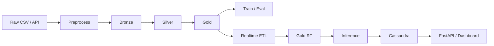

# Hệ dự báo PM2.5 — Bắc Kinh

Pipeline này được chỉnh theo kiến trúc lakehouse + realtime forecast 1 giờ tới: dữ liệu lịch sử đi qua Bronze/Silver/Gold để huấn luyện, dữ liệu API theo giờ đi qua Bronze realtime và hourly ETL để phục vụ dự báo và dashboard. Apache Airflow đóng vai trò scheduler/orchestrator cho cả batch và realtime flow. Các script train/eval/inference hiện dùng chung helper schema để giữ Gold batch và Gold realtime đồng nhất.

## Kiến trúc chính
- MinIO lưu Bronze, Silver, Gold.
- Spark ETL tạo Silver và Gold cho dữ liệu lịch sử.
- XGBoost và LightGBM huấn luyện trên Gold lịch sử.
- Cassandra lưu forecast T+1 cho dashboard.
- FastAPI trong `src/main.py` cung cấp API đọc forecast cho Grafana hoặc React/Next.js, hỗ trợ cả route chuẩn hóa `/forecasts/*` và alias `/api/*`.
- Airflow trong `airflow/dags/pm25_orchestration_dag.py` điều phối các DAG batch và hourly.
- Giao diện dashboard web chạy tại `http://localhost:8000` với tab forecast và tab so sánh model.



## Yêu cầu
- Windows
- Python 3.8+
- Java 11 cho PySpark
- Docker & Docker Compose
- Package Python trong `requirements.txt`

## Cài đặt
1. Tạo môi trường ảo và cài phụ thuộc:

```powershell
python -m venv .venv
.\.venv\Scripts\activate
pip install -r requirements.txt
```

2. Cài JDK 11 và đặt `JAVA_HOME`.
3. Nếu chạy Spark local trên Windows, cấu hình `HADOOP_HOME`.

## Cấu hình
Các hằng chính nằm trong `src/config.py`:
- `MINIO_ENDPOINT`, `MINIO_ACCESS_KEY`, `MINIO_SECRET_KEY`, `BUCKET_NAME`
- `BRONZE_PATH`, `SILVER_PATH`, `GOLD_PATH`, `GOLD_RT_PATH`
- `MODEL_XGBOOST_PATH`, `MODEL_LIGHTGBM_PATH`, `MODEL_METADATA_PATH`
- `CASSANDRA_HOST`, `CASSANDRA_PORT`, `CASSANDRA_KEYSPACE`, `CASSANDRA_FORECAST_TABLE`
- `WEATHER_API_URL`, `AQI_API_URL`

## Khởi động hạ tầng
```powershell
docker-compose up -d
```

MinIO, Spark master/worker, Cassandra, Grafana và Airflow sẽ chạy theo `docker-compose.yml`.

## Chạy pipeline
Mở menu bằng:

```powershell
.\run_pipeline.bat
```

Các bước chính:
- `0_batch_etl.py`: batch historical flow, tạo Silver/Gold từ Bronze lịch sử.
- `1_ingest_api.py`: ingest payload realtime vào Bronze.
- `2_hourly_etl.py`: tạo snapshot features theo cửa sổ 48 giờ cho realtime inference, dùng chung helper schema với Gold batch.
- `3_train_model.py`: huấn luyện XGBoost hoặc LightGBM.
- `4_realtime_inference.py`: dự báo T+1 và ghi vào Cassandra.
- `main.py`: FastAPI backend cho dashboard.
- `airflow/dags/pm25_orchestration_dag.py`: Airflow điều phối DAG batch historical và DAG realtime hourly.

## API phục vụ dashboard
Sau khi có forecast trong Cassandra, chạy:

```powershell
cd src
python main.py
```

Sau đó dashboard web ở `http://localhost:8000` có thể đọc:
- `GET /health`
- `GET /forecasts/latest?station=<station_name>`
- `GET /forecasts/history?station=<station_name>&limit=24`
- `GET /api/stations`
- `GET /api/model-comparison`

Dashboard có 2 tab:
- Dự báo giờ tiếp theo: hiển thị forecast T+1 và timeline gần nhất
- So sánh model: hiển thị biểu đồ MAE, RMSE, R2 Score từ file metrics

## Airflow
Airflow web UI chạy tại `http://localhost:8081` sau khi khởi động stack.
Hai DAG chính:
- `pm25_historical_training`
- `pm25_hourly_forecast`

## Lưu ý vận hành
- `1_ingestion_minio.py` hỗ trợ hai chế độ: historical và `INGEST_MODE=api`.
- `4_batch_inference.py` ghi forecast T+1 theo từng station vào Cassandra.
- `3a_train_xgboost.py` và `3b_train_lightgbm.py` đều lưu metadata để inference khớp feature.

## Tài liệu liên quan
- Kiến trúc chi tiết ở [ARCHITECTURE.md](ARCHITECTURE.md)
- Mô tả file trong [FILES_EXPLANATION.md](FILES_EXPLANATION.md)
- Hướng dẫn test dashboard và mock realtime ở [TEST_DASHBOARD.md](TEST_DASHBOARD.md)
